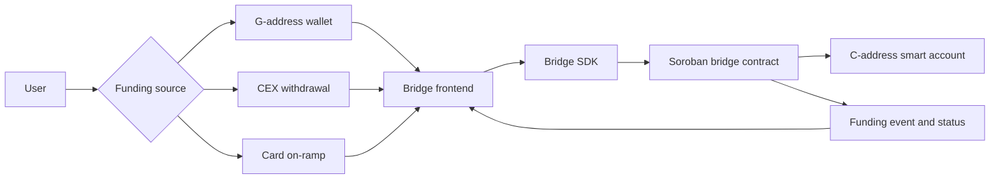

# Stellar and Soroban Glossary

This guide explains the core Stellar and Soroban terms used by the C-Address Bridge frontend. It is written for users, wallet teams, and dApp developers who may understand payments but are new to Soroban smart accounts.

## Bridge Flow

The frontend helps the user choose a funding source, prepare the bridge request, and understand the result. The bridge contract performs the on-chain transfer and emits events that the frontend can show as status updates.

## Glossary

| Term | Meaning | Why it matters in this app |
| --- | --- | --- |
| Stellar | A public blockchain network designed for fast payments and asset transfers. | The bridge routes value on Stellar-compatible rails before it reaches a Soroban smart account. |
| Soroban | Stellar's smart contract platform. | The target C-address is a Soroban smart account, and the bridge contract executes on Soroban. |
| G-address | A classic Stellar account address that starts with G. | Many users and exchanges still start with G-addresses, so the bridge supports funding from that model. |
| C-address | A Soroban contract address that starts with C. | This is the destination account type the bridge is designed to fund directly. |
| Smart account | A contract-controlled account with programmable behavior. | Users can receive funds into an account that can later support richer dApp interactions. |
| Horizon | Stellar's classic API service for accounts, payments, and ledger data. | Integrators may use Horizon for classic Stellar account and payment information. |
| Soroban RPC | The RPC API used to simulate, submit, and inspect Soroban contract transactions. | Contract interaction status and simulation depend on Soroban RPC rather than only Horizon. |
| Freighter | A Stellar wallet browser extension. | Users may connect Freighter to sign transactions or inspect Stellar/Soroban account data. |
| XDR | Stellar's serialized transaction/data format. | The app and SDK may prepare XDRs for signing and submission. Users should never sign XDRs they do not understand. |
| Asset contract | A Soroban contract wrapper for Stellar assets. | Bridge transfers use asset contracts to move value into a target C-address. |
| Memo | Extra data attached to some Stellar transfers. | CEX routing can use memos to map deposits or withdrawals to a target C-address. |
| Transaction simulation | A dry run of a Soroban transaction before submission. | Simulation helps detect missing auth, bad parameters, or insufficient resources before asking the user to sign. |
| Fee basis points | A fee expressed in hundredths of a percent. | The bridge may calculate fees in bps so users can see gross amount, fee, and net amount. |

## Stellar Payments vs Soroban Contract Interactions

| Topic | Stellar payment | Soroban contract interaction |
| --- | --- | --- |
| Primary address type | G-address | C-address contract address |
| Common API | Horizon and Stellar SDKs | Soroban RPC and Stellar/Soroban SDKs |
| Operation shape | Payment or path payment operation | Contract invocation transaction |
| Signing | Source account signs the payment | Signers authorize the contract invocation and any required source account actions |
| State changed | Account balances and ledger entries | Contract storage, token balances, and emitted events |
| Failure examples | Bad trustline, insufficient balance, bad sequence | Failed simulation, missing auth, bad contract ID, resource limits |
| Frontend responsibility | Show amount, asset, destination, and memo clearly | Show contract, method, target C-address, amount, fee, and signing implications clearly |

A Stellar payment is usually a direct value movement between accounts. A Soroban contract interaction is a programmable transaction that can validate inputs, calculate fees, route funds, write contract state, and emit events. The bridge combines these concepts so a user can start from familiar funding sources and land in a Soroban smart account.

## User Safety Notes

- Confirm whether the destination is a G-address or C-address before signing.
- Review the amount, asset, fee, and target address shown by the frontend and wallet.
- Treat unknown XDR signing prompts as high risk unless the app explains the contract and method.
- Use testnet first when integrating a wallet, CEX route, or card on-ramp flow.
- Never paste private keys or seed phrases into the frontend, support tickets, or issue comments.

## Official References

- Stellar documentation: https://developers.stellar.org/docs
- Soroban smart contracts: https://developers.stellar.org/docs/build/smart-contracts
- Stellar SDKs: https://developers.stellar.org/docs/tools/sdks
- Freighter wallet: https://www.freighter.app/
- Stellar laboratory and transaction tools: https://laboratory.stellar.org/
